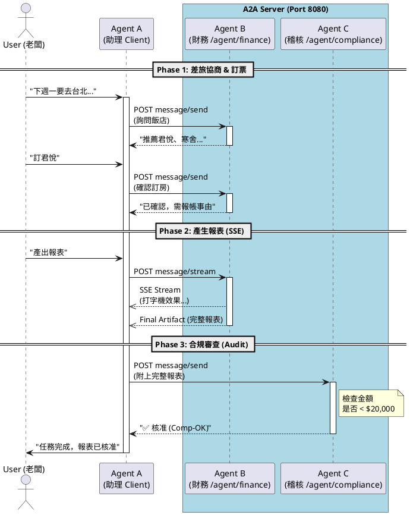

# A2A 跨 Agent 協作展示：公司差旅助手 (多 Agent 版)

本範例展示了 **三個** 獨立的 Agent 如何透過 Google A2A 協定進行複雜的商務協作。

## 👥 角色介紹
1.  **Agent A (助理)**：代表使用者 (Client)，負責協調行程。
2.  **Agent B (財務)**：負責查詢飯店、訂票，並產出報表 (Server, Port 8080/agent/finance)。
3.  **Agent C (稽核)**：負責審查最終報表是否符合預算 (Server, Port 8080/agent/compliance)。

## 💡 展示重點
1.  **多 Agent 協作**：Agent A 先找 B 拿到報表，再把報表丟給 C 審核。
2.  **單一埠口多路徑**：B 和 C 共用 `localhost:8080`，透過 URL Path 區分。
3.  **即時透明**：透過 SSE (串流) 技術，即時看到 Agent B 的產出過程。

---

## 🚀 如何執行

請確保您在專案根目錄下，並已進入具備 Go 環境的 Nix Shell。

### 第一步：啟動服務端 (Agent B + Agent C)
打開一個終端機，執行：
```bash
go run cmd/server/main.go
# 或者使用 Justfile
just run-server
```
您會看到：
```
🚀 A2A Server Cluster Started on :8080
   - Agent B (Finance):    http://localhost:8080/agent/finance
   - Agent C (Compliance): http://localhost:8080/agent/compliance
```

### 第二步：執行測試客戶端 (Agent A - 助理)
打開另一個終端機，執行：
```bash
go run cmd/agent_a/main.go
# 或者使用 Justfile
just run-a
```

---

## 🔍 觀察對話流程

您將在終端機看見以下兩個階段：

### Phase 1: 差旅安排 (A <-> B)
1.  **需求提出**：老闆透過 PA 詢問飯店。
2.  **精確建議**：TF (財務) 根據公司政策回傳飯店選項。
3.  **細節確認**：PA 選擇飯店並要求訂高鐵。
4.  **串流結案**：TF 透過 SSE 產生最終報表。

### Phase 2: 合規審查 (A -> C)
1.  **送審**：PA 將 B 產生的報表送給 C。
2.  **裁決**：C 判斷總金額 ($15,500) 小於預算 ($20,000)，回傳 **✅ [核准]**。

### 📊 協作時序圖 (PlantUML)



---

## 🛠 技術架構
*   **通訊協定**: HTTP POST + JSON-RPC 2.0
*   **路由模式**: Single Port, Multiple Paths (`/agent/finance`, `/agent/compliance`)
*   **無依賴設計**: 完全使用 Go 標準庫。

---

## 📚 參考資源

*   **官方範例庫**: [https://github.com/a2aproject/a2a-samples/](https://github.com/a2aproject/a2a-samples/)
*   **A2A 協定文件**: [https://a2a-protocol.org/latest/](https://a2a-protocol.org/latest/)
